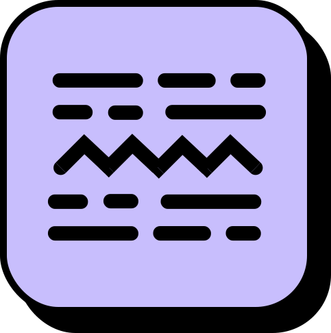
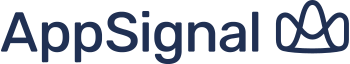

    
    <h2 align="center">Glossia</h2>
    

    The open-source AI-powered localization platform.
     
    <a href="https://glossia.ai"><strong>Learn more »</strong></a>
     
     
    <a href="https://discord.gg/zqZxSBXKf8">Discord</a>
    ·
    <a href="https://glossia.ai">Website</a>
    ·
    <a href="https://github.com/glossia/glossia/issues">Issues</a>
    ·
    <a href="https://github.com/glossia/glossia/milestones">Roadmap</a>
  

  
   
   
   
   

## Why Glossia?

We believe **AI holds the transformative power to revolutionize the world of continuous localization**, stripping away the complexities of legacy systems. While sectors like software development thrive on the open-source collaborative spirit of platforms like [GitHub](https://github.com), the localization industry remains entangled in proprietary confines, stifling innovation. These silos often lead organizations down a maze of expensive, convoluted systems that challenge comprehension. But we envision a different path.

**Glossia is spearheading change.** We champion **openness**, crafting our innovations with the world watching and inviting all to contribute. This inclusive approach harnesses a tapestry of diverse thoughts and the electric energy of a passionate community eager to redefine the industry. We're delving deep, **reimagining the foundational translation memory, exploring its AI-driven evolution for more intuitive designs.** *Our goal?* A system that's both simplified and potent, seamlessly integrating with content-rich platforms across the web, from [Shopify](https://shopify.com) to [Canva](https://canva.com). At Glossia, we're all in on AI, championing a universally accessible future of localization. Join us on this journey.

## Usage

You can check [out our documentation](./priv/docs/README.md) if you would like to use Glossia in your projects. Note that the project is a work in progress and changing rapidly so we recommend joining our [Discord server](https://discord.gg/zqZxSBXKf8) to let us know about your project and give you a hand on getting onboarded.

## Development

Glossia's website and app run on [Elixir](https://elixir-lang.org/) and [Phoenix](https://www.phoenixframework.org/), with [Deno](https://deno.land/) handling one-off tasks in transient Linux environments.

### Local set up

1. Clone the repository: `git clone git@github.com:glossia/app.git`
2. Install the dependencies: `mix deps.get`
3. Start Phoenix endpoint with `mix phx.server` or inside IEx with `iex -S mix phx.server`

### Useful commands

- Open a remote console with production: `flyctl ssh console --pty -C "/app/bin/glossia remote"`
- Generate a graph of dependencies: `mix xref graph`
- Seed data: `mix run priv/repo/seeds.exs`
- **Gettext**
  - Extract content: `mix gettext.extract`
  - It merges the content into the English file: `mix gettext.merge priv/gettext`
  - Extract content and merge: `mix gettext.extract --merge`

### Resources

- `Plug.Conn` [status codes](https://hexdocs.pm/plug/Plug.Conn.Status.html#code/1-known-status-codes)
- Elixir [Typespecs](https://hexdocs.pm/elixir/1.12/typespecs.html)

## Supporters

AppSignal supports Glossia by giving us access to its [open source plan](https://www.appsignal.com/open-source) for application performance monitoring.

GitBook supports Glossia by giving us access to its [open source plan](https://docs.gitbook.com/account-management/plans/apply-for-the-non-profit-open-source-plan). GitBook is our platform of choice for knowledge management.